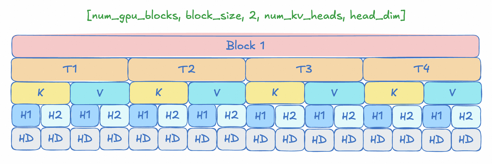
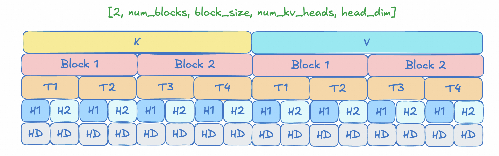
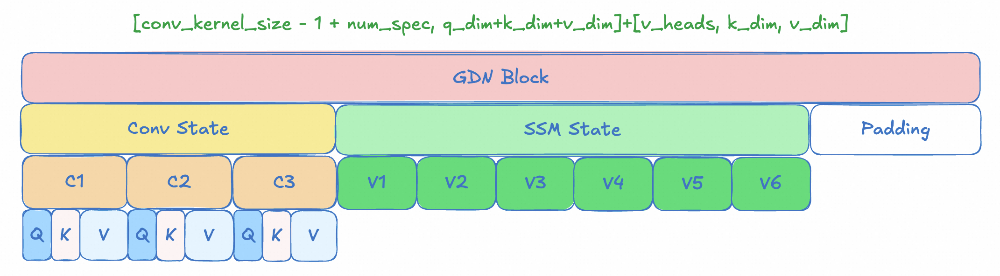
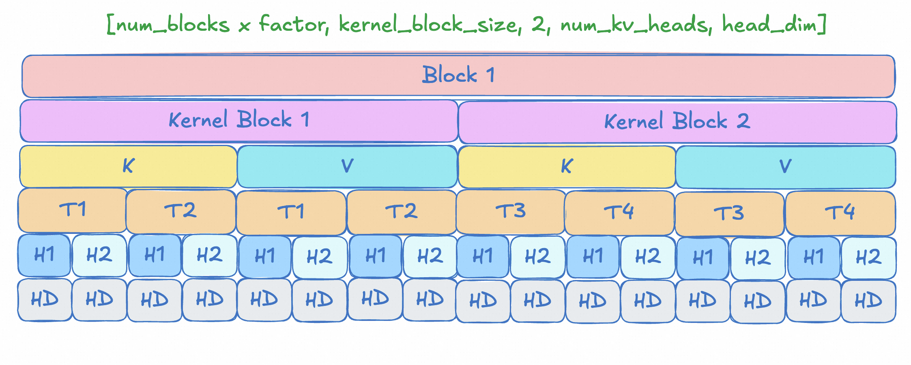
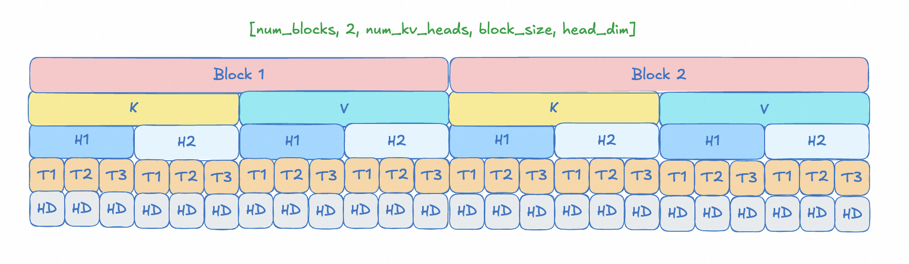

# CacheTransferSpec 重构文档

## 1. 背景

`tx_stub.cpp` 中原有多个手写的 `parse_block_send_*` 静态函数，每个函数针对特定的 cache shape 和 P/D TP size配置，手动计算 `IpcBlock` 的 `src_offset`、`dst_offset` 和 `length`。

这些函数包括：

| 函数名 | Cache Shape | TP 配置 |
|--------|-------------|---------|
| `parse_block_send_p_eq_d` | RAGGED_FLASH | P==D |
| `parse_block_send_p_gt_d` | RAGGED_FLASH | P>D |
| `parse_block_send_p_gt_d_dpsk` | RAGGED_FLASH (DPSK) | P>D (token_sizes 相同) |
| `vllm_parse_block_send_p_eq_d` | FLASH | P==D |
| `vllm_parse_block_send_p_gt_d` | FLASH | P>D |
| `vllm_parse_hybrid_block_send_p_eq_d_block_aligned` | QWEN3_NEXT | P==D (block 粒度发送) |
| `vllm_parse_hybrid_block_send_p_gt_d` | QWEN3_NEXT | P>D |
| `vllm_parse_block_send_multi_tensor_p_eq_d` | DPSK_V32 | P==D |
| `vllm_parse_block_send_multi_tensor_p_gt_d` | DPSK_V32 | P>D |
| `vllm_parse_flashinfer_block_send_p_eq_d` | FLASHINFER | P==D |
| `vllm_parse_flashinfer_block_send_p_gt_d` | FLASHINFER | P>D |

重构将 offset 计算逻辑抽象为两个层次：

1. **Layout 描述层**（`AttnLayoutDesc`）：每种 cache shape 通过维度顺序（`dim_order`）和若干布尔标志描述其内存布局特征，注册在静态 layout 注册表中。
2. **统一构建层**（`build_attn_spec_from_layout`）：根据 layout 描述和 P/D TP size 自动推导 `AttnSpec` 的所有 stride/offset 参数，无需为每种 cache shape 编写独立的构建函数。

`build_transfer_plan` 根据 layout 描述统一处理 P==D、P>D 两种情况（暂不考虑P<D），自动生成 `TransferPlan`。新增 cache shape 只需在 layout 注册表中添加一条记录。

---

## 2. 数据结构

所有结构定义在 `cache_transfer_spec.h` 和 `attn_layout.h` 中。

### 2.1 AttnSpec

描述单个 token 级别的 K（或合并 KV）拷贝流，可选包含 V 的偏移参数。每个 token 的 src 和 dst offset 按以下公式计算：

```
offset = blocks[block_idx] * block_stride
       + token_idx * token_stride
       + base_offset
       + global_offset
       + head_iter * head_stride
```

K 组件字段：

| 字段 | 含义 |
|------|------|
| `src_block_stride` / `dst_block_stride` | block 编号到字节偏移的步长（通常为 block_size） |
| `src_token_stride` / `dst_token_stride` | token 编号到字节偏移的步长（通常为 token_size） |
| `src_base_offset` / `dst_base_offset` | block 内的固定偏移（如 P>D 时的 group_off 偏移，或 K/V 分区偏移） |
| `src_global_offset` / `dst_global_offset` | 全局偏移（如 FLASH_CACHE_SHAPE 的 V 层偏移） |
| `bytes_per_token` | 每个 token 实际拷贝的字节数 |
| `head_num` | KV head 数（FLASHINFER head-major 布局使用，默认为 1） |
| `src_head_stride` / `dst_head_stride` | 相邻 head 之间的字节跨距（= ntpb * head_dim * dtype_size） |

V 组件（`AttnSpec::VSpec`，可选）：

当 K 和 V 需要分开传输时，`v` 字段携带 V 的偏移参数。V 与 K 共享 `block_stride`、`token_stride`、`bytes_per_token`、`head_num`，仅以下字段可不同：

| 字段 | 含义 |
|------|------|
| `src_base_offset` / `dst_base_offset` | V 在 block 内的固定偏移 |
| `src_global_offset` / `dst_global_offset` | V 的全局偏移（FLASH 布局中 V 通过 `layer_size` 定位） |
| `src_head_stride` / `dst_head_stride` | V 的 head 跨距（FLASHINFER `v_head_invariant` 时为 0） |

各布局下 `v` 的设置：

| 场景 | v | 说明 |
|------|---|------|
| P==D 合并 KV（RAGGED_FLASH, DPSK_V32） | `nullopt` | `bytes_per_token = token_size`，K+V 一起传输 |
| P==D block-aligned（QWEN3_NEXT） | `nullopt` | 整块传输 |
| P==D kv_outermost（FLASH） | 设置 | V 通过 `global_offset = layer_size` 定位 |
| P==D head_outer（FLASHINFER） | 设置 | V 的 `base_offset`、`head_stride` 不同 |
| P>D 所有布局 | 设置 | K 和 V 必须分开传输 |

### 2.2 GdnSegment / GdnSpec

用于 Qwen3/3.5-Next 的 GDN Block传输。GDN 不按 token 粒度传输，而是按Conv/SSM两种cache进行传输。

```
GdnSegment:
  src_offset_in_block  -- block内src offset
  dst_offset_in_block  -- block内dst offset
  length               -- 发送数据长度

GdnSpec:
  num_groups           -- GDN 层数（= WorkerInfo::num_gdn_layers），每组在 BlockIds 中有独立的 block 列表
  src_block_stride     -- src侧 block size(bytes)
  dst_block_stride     -- dst侧 block size(bytes)
  segments             -- 段列表（P==D 时 1 段，P>D 时含多个 conv + ssm 段）
```

GDN Block仅在 `reach_last_token == true`（即 chunked prefill 完成）时传输。`generate_gdn` 按 group 迭代，每组使用 `src_blocks[g]` 和 `dst_blocks[g]`。

### 2.3 AttnComponent / GdnComponent

Token 级传输组件和 GDN 传输组件，是 `CacheTransferSpec` 内部的基本构成单元。

```cpp
struct AttnComponent {
  AttnSpec spec;             // K (+ 可选 V) 的 token 级拷贝描述
  uint32_t block_group = 0;  // BlockIds 中对应的 group 索引
  uint32_t src_ntpb = 0;     // 每个 block 的 token 数（src 侧）
  uint32_t dst_ntpb = 0;     // 每个 block 的 token 数（dst 侧）
  bool block_aligned = false; // 是否以整块粒度传输
};

struct GdnComponent {
  GdnSpec spec;  // GDN 内部通过 num_groups 遍历 BlockIds 的 group 0..num_groups-1
};
```

`AttnComponent` 用于 attention 和 indexer 两种场景：
- **fullattn**：主 attention 传输，`spec` 可含 VSpec
- **indexer**：QWEN3_NEXT 混合模型的 indexer cache，`spec` 只有 K（`v = nullopt`）

### 2.4 CacheTransferSpec

单个 cache tensor 的传输规格。由有序的组件列表组成，构建时确定顺序。

```cpp
using TransferComponent = std::variant<AttnComponent, GdnComponent>;

struct CacheTransferSpec {
  std::vector<TransferComponent> components;  // 构建时有序：GDN -> Indexer -> FullAttn
  bool valid = true;                          // 当前 rank 是否参与传输
};
```

组件顺序（`build_transfer_plan` 构建时确定）：

1. **GdnComponent**（仅 `reach_last_token` 时处理）
2. **AttnComponent** for indexer（若有）
3. **AttnComponent** for fullattn

### 2.5 TransferPlan

```cpp
struct TransferPlan {
  std::vector<CacheTransferSpec> specs;  // 每个 cache tensor 一个 spec
  TPKind tpkind;                         // PEQD / PGTD
};
```

对于单 tensor 的 cache shape（RAGGED_FLASH、FLASH、QWEN3_NEXT、FLASHINFER），`specs` 只有 1 个元素。
对于多 tensor 的 cache shape（DPSK_V32_SPARSE_MLA），`specs` 有多个元素，每个对应一个 cache tensor。

### 2.6 CacheDim 枚举

定义在 `attn_layout.h` 中，表示 cache tensor 的五个维度：

| 枚举值 | 含义 |
|--------|------|
| `BLOCK` | num_gpu_blocks |
| `TOKEN` | tokens_per_block |
| `KV` | 2（K 和 V） |
| `HEAD` | num_kv_heads |
| `HEAD_DIM` | head_dim |

### 2.7 AttnLayoutDesc

定义在 `attn_layout.h` 中，描述一种 cache shape 的内存布局特征。通过 `dim_order` 和若干布尔标志驱动统一的 spec 构建算法。

| 字段 | 含义 |
|------|------|
| `dim_order` | 从最外层到最内层的维度顺序（5 个 CacheDim 的数组） |
| `num_tensors` | 每层的 cache tensor 数（DPSK_V32 设为 0，运行时从 `WorkerInfo::token_sizes.size()` 获取） |
| `block_aligned_peqd` | P==D 时使用 block 对齐传输（整块粒度） |
| `v_head_invariant` | V 组件的 `head_stride=0`，dst 侧无 TP group offset（FLASHINFER 特有） |
| `use_valid_ranks` | P>D 时通过 `WorkerInfo::valid_ranks` 过滤无效 rank |
| `valid_ranks_affects_group_n` | 当 `use_valid_ranks=true` 时，`group_n = valid_count / dst_tp`（而非 `src_tp / dst_tp`） |
| `rank0_only_when_same_sizes` | P>D 但 token_sizes 相同时，仅 rank 0 发送（视为 P==D） |
| `force_peqd_tpkind` | 强制 TPKind 为 PEQD（DPSK_V32 MLA 架构使用） |

辅助方法（基于 `dim_order` 中 KV/HEAD/TOKEN/BLOCK 的相对位置推导）：

| 方法 | 含义 | 对应 Cache Shape |
|------|------|-----------------|
| `is_kv_outermost()` | KV 维度在 BLOCK 之前 | FLASH |
| `is_kv_between_block_and_token()` | KV 维度在 BLOCK 和 TOKEN 之间 | QWEN3_NEXT |
| `is_kv_inner_to_token()` | KV 维度在 TOKEN 之后 | RAGGED_FLASH、DPSK_V32 |
| `is_head_outer_to_token()` | HEAD 维度在 TOKEN 之前 | FLASHINFER |

各 Cache Shape 的注册配置：

| Cache Shape | dim_order | 关键标志 |
|-------------|-----------|----------|
| RAGGED_FLASH | `[BLOCK, TOKEN, KV, HEAD, HEAD_DIM]` | `rank0_only_when_same_sizes` |
| FLASH | `[KV, BLOCK, TOKEN, HEAD, HEAD_DIM]` | `use_valid_ranks` |
| QWEN3_NEXT | `[BLOCK, KV, TOKEN, HEAD, HEAD_DIM]` | `block_aligned_peqd`, `use_valid_ranks`, `valid_ranks_affects_group_n` |
| DPSK_V32 | `[BLOCK, TOKEN, KV, HEAD, HEAD_DIM]` | `num_tensors=0`(运行时), `rank0_only_when_same_sizes`, `force_peqd_tpkind` |
| FLASHINFER | `[BLOCK, KV, HEAD, TOKEN, HEAD_DIM]` | `v_head_invariant`, `use_valid_ranks`, `valid_ranks_affects_group_n` |

---

## 3. IpcBlock 生成

实现在 `cache_transfer_spec.cpp` 中

### 3.1 入口函数

`generate_all_ipc_blocks(plan, task, send_blocks)` 遍历 plan 中所有 spec，为每个 cache tensor 生成对应的 IpcBlock 列表。

```
generate_ipc_blocks(spec, src_blocks, dst_blocks, wrote_tokens, left_tokens, reach_last_token, out)
```

其中 `src_blocks` 和 `dst_blocks` 为 `BlockIds`（`vector<vector<uint32_t>>`），外层 vector 表示不同 cache group（如 QWEN3_NEXT 的 GDN 组、indexer 组、attn 组）。

`generate_ipc_blocks` 遍历 `spec.components`，按构建时确定的顺序处理每个组件：

```
for comp in spec.components:
    match comp:
        AttnComponent -> generate_attn() 或 generate_block_aligned()
        GdnComponent  -> generate_gdn()（仅 reach_last_token 时）
```

每个组件通过自身的 `block_group` 索引从 `BlockIds` 中获取对应的 block 列表。

### 3.2 Token 粒度传输（generate_attn）

处理一个 `AttnSpec` 中的 K 和 V（如果有 `VSpec`）两个分量：

1. **K 分量**：使用 `AttnSpec` 的主字段计算 offset（通过 `generate_k_block`）
2. **V 分量**（若 `spec.v` 有值）：使用 `VSpec` 的 `base_offset`/`global_offset`/`head_stride`，共享 K 的 `block_stride`/`token_stride`/`bytes_per_token`/`head_num`（同样复用 `generate_k_block`）

每个流的处理：
1. 根据 `wrote_tokens + done` 计算当前 token 所在的 block 索引和 block 内偏移。
2. 计算本次可连续处理的 token 数（不超出 src block 边界、dst block 边界、剩余 token 数三者的最小值）。
3. 对每个 head 迭代（`head_num` 次），逐 token 生成 `IpcBlock`，每个 length = bytes_per_token。相邻 IpcBlock 的合并在后续 `register_data` 阶段统一处理。

输出顺序：先生成所有 K 的 IpcBlock，再生成所有 V 的 IpcBlock。

### 3.3 Block 粒度传输（generate_block_aligned）

当 `AttnComponent.block_aligned = true` 时使用。以整个 block 为传输粒度，根据 chunked prefill 的语义决定是否发送：

| 条件 | 发送策略 |
|------|----------|
| `tokens == ntpb`（完整 block） | 发送整个 block |
| `reach_last_token`（请求最后一块） | 发送整个 block |
| `token_idx == 0`（chunked prefill 末尾块，下一步继续） | 不发送，延迟到下一步 |
| `token_idx + tokens == ntpb`（到达 block 边界） | 发送整个 block |
| 其他（block 中间，请求未完成） | 不发送，延迟到下一步 |

### 3.4 GDN 传输（generate_gdn）

仅在 `reach_last_token == true` 时处理。按 group 遍历 GDN，每组使用 `src_blocks[g]` 和 `dst_blocks[g]`：

```
for g in 0..num_groups:
    for block_idx in 0..src_blocks[g].size():
        for segment in segments:
            out.emplace_back(
                src_blocks[g][block_idx] * src_block_stride + segment.src_offset,
                dst_blocks[g][block_idx] * dst_block_stride + segment.dst_offset,
                segment.length
            )
```

---

## 4. 构建逻辑

### 4.1 Layout 注册表

`get_attn_layout(cache_shape)` 从静态注册表中查找 `AttnLayoutDesc`。新增 cache shape 只需在注册表中添加一条记录，无需编写新的构建函数。注册表定义在 `cache_transfer_spec.cpp` 中。

### 4.2 统一 Attn Spec 构建（build_attn_spec_from_layout）

`build_attn_spec_from_layout` 根据 `AttnLayoutDesc` 的 `dim_order` 推导 KV 维度的位置关系，返回一个 `AttnComponent`：

```
build_attn_spec_from_layout(layout, p_block_size, p_token_size,
                            d_block_size, d_token_size, group_off,
                            layer_num_blocks_src, layer_num_blocks_dst, head_num)
```

参数说明：

| 参数 | 含义 |
|------|------|
| `layout` | 当前 cache shape 的 AttnLayoutDesc |
| `p_block_size` / `p_token_size` | src 侧的 block/token 字节大小 |
| `d_block_size` / `d_token_size` | dst 侧的 block/token 字节大小 |
| `group_off` | TP group 内的 offset（P==D 时为 0） |
| `layer_num_blocks_src` / `layer_num_blocks_dst` | 每层的 block 数（FLASH 布局用于计算 layer_size） |
| `head_num` | head 数（仅 FLASHINFER head-outer 布局使用） |

内部计算的关键中间量：

```
p_k_token = p_token_size / 2          // K 部分的 per-token 字节数
d_k_token = d_token_size / 2
src_ntpb  = p_block_size / p_token_size
dst_ntpb  = d_block_size / d_token_size
p_k_block = src_ntpb * p_k_token      // 一个 block 中 K 部分的字节数
d_k_block = dst_ntpb * d_k_token
```

当 `env_bf162fp8_conversion()` 且非 P==D 时，`effective_p_k_token = p_k_token / 2`。

组件生成策略（根据 `dim_order` 自动选择）：

| 条件 | 策略 | 对应 Cache Shape |
|------|------|-----------------|
| P==D 且 `block_aligned_peqd` | 单个 block-aligned 组件，`block_aligned=true`，`v = nullopt` | QWEN3_NEXT |
| P==D 且非 head_outer 且非 kv_outermost | 单个 KV 合并组件（`bytes_per_token = token_size`），`v = nullopt` | RAGGED_FLASH、DPSK_V32 |
| `is_head_outer_to_token()` | K 使用 `head_num` 和 `head_stride`；V 通过 `VSpec` 设置不同的 `base_offset` 和 `head_stride`（`v_head_invariant` 时为 0） | FLASHINFER |
| `is_kv_outermost()` | K 的 `block_stride = k_block_size`；V 通过 `VSpec.global_offset = layer_size` 定位 | FLASH |
| `is_kv_between_block_and_token()` | K 的 `block_stride = block_size`；V 通过 `VSpec.base_offset = k_block_size` 定位 | QWEN3_NEXT (P>D) |
| `is_kv_inner_to_token()` | K 的 `token_stride = token_size`；V 通过 `VSpec.base_offset = k_token_size` 定位 | RAGGED_FLASH (P>D) |

### 4.3 build_transfer_plan

`build_transfer_plan(cache_shape, src, dst)` 为入口函数，根据 cache shape 和 P/D worker 信息构建 `TransferPlan`。内部无 per-shape 分支，所有行为由 `AttnLayoutDesc` 的标志驱动。

组件按以下顺序插入 `CacheTransferSpec.components`：

1. **GdnComponent**（仅 `reach_last_token` 时处理）
2. **AttnComponent** for indexer（若有）
3. **AttnComponent** for fullattn

**P==D 路径**：

1. 对每个 tensor 调用 `build_attn_spec_from_layout`（`group_off=0`）得到 fullattn `AttnComponent`
2. 若 `has_gdn`：插入 `GdnComponent`（`build_gdn_peqd`）
3. 若 `has_indexer`：插入 `AttnComponent`（`block_aligned=true`，`block_group = num_gdn_layers`）
4. 设置 fullattn 的 `block_group = num_gdn_layers + (has_indexer ? 1 : 0)`

**P>D 路径**：

1. **rank0_only_when_same_sizes 快捷路径**：若 `layout.rank0_only_when_same_sizes` 且 P/D 的 `token_sizes` 相同，仅 rank 0 按 P==D 方式发送，其余 rank 返回空 plan（`tpkind=PEQD`）
2. **计算 group_off**：
   - 若 `use_valid_ranks`：通过 `src.valid_ranks` 过滤无效 rank，effective_rank 直接使用 `src.kvt_tp_rank`；若 `valid_ranks_affects_group_n`，则 `group_n = valid_count / dst_tp`
   - 否则：`group_n = src_tp / dst_tp`，`group_off = rank % group_n`
3. 若该 rank 被过滤且无 GDN/indexer，返回 `valid=false` 的 spec
4. 若 `has_gdn`：插入 `GdnComponent`（`build_gdn_pgtd`）
5. 若 `has_indexer` 且 rank 0：插入 indexer `AttnComponent`（`block_aligned=false`，使用 `src.hybrid_indexer_token_size` 作为 token_stride）
6. 若 `sends_attn`：调用 `build_attn_spec_from_layout` 得到 fullattn `AttnComponent`，设置 `block_group`

### 4.4 每个 Cache Shape 的内存布局

#### RAGGED_FLASH_CACHE_SHAPE

内存布局：`[num_gpu_blocks, block_size, 2, num_kv_heads, head_dim]`

<p align="center">
  
</p>

K 和 V 在每个 token 内交错排列，token_size = 2 * num_kv_heads_per_rank * head_dim * dtype_size。

- **P==D**：`is_kv_inner_to_token()` 且非 head_outer、非 kv_outermost → KV 合并，`v = nullopt`，`bytes_per_token = token_size`，可合并为 block 级别的大 IpcBlock。
- **P>D**：`is_kv_inner_to_token()` → `v` 设置，V 通过 `v.base_offset = k_token_size` 定位。
- **DPSK 特例**（P>D 但 token_sizes 相同）：`rank0_only_when_same_sizes=true`，仅 rank 0 发送。

#### FLASH_CACHE_SHAPE

内存布局：`(2, num_blocks, block_size, num_kv_heads, head_dim)`

<p align="center">
  
</p>

K 和 V 存放在分离的层级区域，K 位于偏移 0 处，V 位于偏移 `layer_size` 处。

- **P==D**：`is_kv_outermost()` → `v` 设置，V 通过 `v.global_offset = layer_size` 定位。两者均可合并。
- **P>D**：`is_kv_outermost()` → 类似 P==D 但使用 `group_off` 计算 `dst_base_offset`。`use_valid_ranks=true` 过滤无效 rank。支持 `env_bf162fp8_conversion()` 半精度转换。

#### QWEN3_NEXT_FLASH_CACHE_SHAPE

混合模型，BlockIds 采用多 group 布局：

- **Group 0..num_gdn_layers-1**：GDN 层，每组一个 block 列表（conv state + ssm state）
- **Group num_gdn_layers**（可选）：indexer 块，当 `indexer_blk_ntpb > 0` 时存在
- **Group num_gdn_layers + (indexer?1:0)**：Attention 块

<p align="center">
  
</p>

<p align="center">
  
</p>

`CacheTransferSpec.components` 的顺序：`[GdnComponent, AttnComponent(indexer), AttnComponent(fullattn)]`

- **P==D（block-aligned）**：`block_aligned_peqd=true` → fullattn 的 `block_aligned=true`，attention 块以整块粒度传输。GDN 通过 `GdnComponent` 在 `reach_last_token` 时整块发送。Indexer 以 `block_aligned=true` 传输。
- **P>D**：`is_kv_between_block_and_token()` → fullattn 的 `v` 设置，V 通过 `v.base_offset = k_block_size` 定位。GDN 通过 `GdnComponent`（`build_gdn_pgtd`）按 conv/ssm 分段传输。Indexer 仅 rank 0 发送（`block_aligned=false`）。`use_valid_ranks=true` + `valid_ranks_affects_group_n=true` 影响 attn 的 group 计算；GDN 分组使用 `src.engine_tp_size / dst.kvt_tp_size`。Conv 子通道的 offset 计算方式：
  ```
  p_conv_dim_size = conv_state_shape[2] * gdn_conv_elem_size
  d_conv_dim_size = gdn_group_n * p_conv_dim_size
  conv_step_length = conv_channel_dims[i] * gdn_conv_elem_size

  p_conv_off = conv_dim * p_conv_dim_size + conv_dim_inner_offset
  d_conv_off = conv_dim * d_conv_dim_size + gdn_group_n * conv_dim_inner_offset + gdn_group_off * conv_step_length
  ```

#### DPSK_V32_SPARSE_MLA_SHAPE

每层有多个 cache tensor，token_sizes 和 block_sizes 均为向量。`num_tensors=0`，运行时从 `WorkerInfo::token_sizes.size()` 获取。

- **P==D**：每个 tensor 独立调用 `build_attn_spec_from_layout`（`is_kv_inner_to_token()` → KV 合并，`v = nullopt`）。
- **P>D token_sizes 相同**（DPSK 场景）：`rank0_only_when_same_sizes=true`，仅 rank 0 发送所有 tensor。
- **P>D token_sizes 不同**：每个 tensor 使用 `build_attn_spec_from_layout`（`is_kv_inner_to_token()` → `v` 设置）。`force_peqd_tpkind=true` 使 TPKind 始终为 PEQD。

#### FLASHINFER_CACHE_SHAPE

<p align="center">
  
</p>

内存布局：`(num_blocks, 2, num_kv_heads, block_size, head_dim)`

head-major 布局（`is_head_outer_to_token()`），每个 head 内 token 连续。使用 `head_num` 按 head 迭代。

- **K Cache**：`head_stride = head_size`，每次迭代跳到下一个 head。
- **V Cache**：`v_head_invariant=true` → `VSpec.head_stride = 0`，dst 侧无 group_off 偏移。
- **P>D**：`use_valid_ranks=true` + `valid_ranks_affects_group_n=true` 过滤无效 rank 并影响 group_n 计算。`group_off` 用于 dst 侧 K 偏移。

### 4.5 辅助 Build 函数

| 函数 | 用途 |
|------|------|
| `build_attn_spec_from_layout(...)` | 根据 AttnLayoutDesc 统一构建 AttnComponent（含 K + 可选 VSpec） |
| `build_gdn_peqd(block_size, ntpb, token_size, worker_info)` | 构造 P==D 的 GDN spec（整块传输，num_groups 来自 `worker_info.num_gdn_layers`） |
| `build_gdn_pgtd(p_block_size, d_block_size, gdn_group_n, gdn_group_off, worker_info)` | 构造 P>D 的 GDN spec（conv/ssm 形状、elem size、channel dims 均来自 `worker_info` 字段） |

---

## 5. tx_stub.cpp 变更

**构建阶段**（`refresh_dst_info`）：

`tx_stub` 当前是**双路径分发**：

1. 当 `BLLM_KVTRANS_TX_PARSE_MODE` 开启 `cache_spec` 时：
   - `self.transfer_plan = build_transfer_plan(...)`
   - 发送阶段走 `generate_all_ipc_blocks(...)`
2. 其他情况（默认）：
   - 继续走主线 `parse_block_common + parse_block_*` 分发
   - 包含 `RAGGED/FLASH/QWEN3_NEXT/DPSK/FLASHINFER` 的 parse 函数指针选择逻辑

**执行阶段**（`do_task`）：
- `transfer_plan` 存在：`generate_all_ipc_blocks(self.transfer_plan.value(), ...)`
- 否则：`self.parse_block(...)`

**TPKind 获取**：
- `register_data` 使用统一逻辑：`transfer_plan` 存在取 `transfer_plan->tpkind`，否则取 `self.tpkind`。
